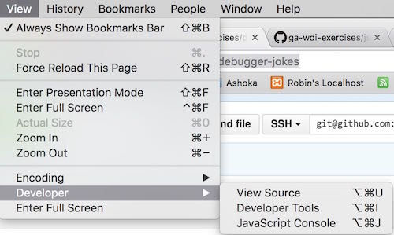
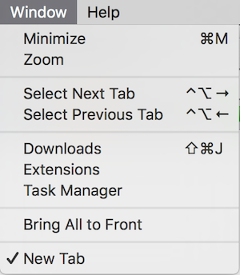
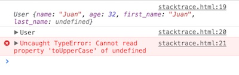
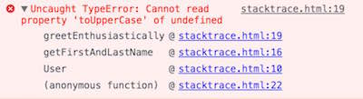
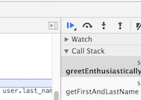
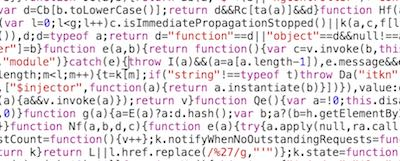

# JS Debugging

## Learning Objectives
*After this lesson, students will be able to:*

* Identify and resolve common and uncommon "logical errors" that affect the results of your program.
* Use logs to troubleshoot errors in an application.
* Conduct real-time debugging in the browser.
* Differentiate between Syntax, Reference, and Type errors.

## Preparation

### Before this lesson, students should already be able to...
* Use Chrome dev tools
* Use a text editor

### Prior to the lesson, make sure you have...
* Cloned this repo: `$ git clone git@github.com:ga-wdi-lessons/js-debugging.git`
* [Downloaded and installed Chrome](https://www.google.com/chrome/).

## Framing

This class is about Javascript errors and what to do when you get one.

First, we'll discuss:

# I Do: How Errors Are Made (10 minutes / 0:10)

## Throwing An Error

Errors don't just happen. Chrome doesn't just "break". In fact, it's not Chrome that's throwing the error at all: it's Javascript.

Whenever you run into an error, it's because somewhere in the code you're running or in Javascript's source code there's a line that says, "When this happens, throw an error."

Let's see how to throw an error. **Please close your computers and just watch me.** We're asking you to do this because we don't want anyone to worry about throwing custom errors when working on Javascript projects in this class. We're showing this to you simply so you know what "magic" is going on under the surface.

Here's a piece of HTML/JS that "throws" an error...

```html
<!DOCTYPE html>
<html>
  <head>
    <title>JS Errors</title>
    <script>
    throw(new Error("Oh, noes."));
    console.log("Such is life.");
    </script>
  </head>
  <body></body>
</html>
```

The result:

```
Uncaught Error: Oh, noes.       index.html:6
```

The `console.log` doesn't happen.

## Error handling

You probably don't want an error to stop whatever your app's doing. You can tell Javascript, "If an error like such-and-such occurs, then do this specific thing instead of simply breaking and stopping." This is called **error handling**.

To handle an error you have to "catch" it (errors are "thrown", and must be "caught"). An "uncaught" error will cause the app to stop.

Here's an example of catching an error:

```html
<!DOCTYPE html>
<html>
  <head>
    <title>JS Errors</title>
    <script>
    try{
      throw(new Error("Oh, noes."));
    }catch(err){
      console.log("Oops! There was an error. It says: " + err.message);
    }
    console.log("Such is life.");
    </script>
  </head>
  <body></body>
</html>
```

The result:

```
Oops! There was an error. It says: Oh, noes.
Such is life.
```

This time the `console.log` *does* happen. When you "catch" an error Javascript does whatever you tell it to do in response to the error, and then keeps on going. When you don't catch an error, Javascript stops.

Javascript is intentionally "trying" some code, and if the code throws an error, Javascript is waiting to "catch" it.

This `try...catch` system is something most programming languages have although it may use different verbs.

### And that's all we'll say about error handling for now...

Again, error handling is an advanced concept. Generally we don't recommend getting into it until everything else on your app is very well-polished.

# Chrome Developer Tools

So you have an uncaught error. Now what?

### Set up (5 minutes / 0:15)

If you haven't already, [please download Chrome](https://www.google.com/chrome/).

All browsers have developer tools that are very similar. But just for consistency's sake, we'll ask that you use Chrome for this lesson.

You can open it from the View menu as shown here...



Let's take a tour of the features and tools available to us in Chrome's dev tools...

## Keyboard Shortcuts (5 minutes / 0:20)

Notice those weird characters to the right of all the things on the menu? Each is the keyboard shortcut for that menu item. Knowing the keyboard shortcut will make your life a million times easier.

> "View Source" is `Command` + `Option` + `U`. It shows the HTML for a page.

Here's a table of what those weird characters mean:

| Symbol | Name |
| --- | --- |
| &#8984; | Command |
| &#8997; | Option |
| &#8679; | Shift |
| ^ | Control |
| &#9166; | Return |
| &#9003; | Delete |
| &#9099; | Escape |
| &#8682; | Caps lock |

**Spend a minute finding the shortcuts for the following commands and practicing them...**
* View the source code of an HTML page.
* Open Chrome's dev tools.
* Open the browser's Javascript console.

> There are more Chrome shortcuts than the ones we discussed here. [Take a look at this comprehensive list](https://support.google.com/chrome/answer/157179?hl=en).

#### Disable Caching

Click the little dots at the top-right of the console and select "settings".


Check the "Disable cache" box. This makes sure Chrome reloads your Javascript whenever you refresh the page.


## Task Manager (5 minutes / 0:25)

Whatever page you're looking at in Chrome right now, open the console and enter...

```js
while(true){}
```

Now press enter.

<details>

  <summary><strong>Q. What just happened? Why can you no longer click anything on the page?</strong></summary>

  > You just put Javascript into an infinite loop. This prevents anything else from happening on the page.

</details>
<br/>

To make this stop, you can quit Chrome, wait for Chrome to throw an error, **or** stop this Javascript using Chrome's Task Manager in the "Window" menu.

This is similar to the Task Manager in Windows.



This shows you all the tabs, windows, and extensions Chrome is currently running. You should see the tab with the infinite loop taking up about 99% of your computer's CPU (central processing unit).


That's a problem! Click the row containing that tab, and click "End process".

## Open Files in Chrome Using Terminal (5 minutes / 0:30)

The last thing we want to do before getting into some actual debugging is to make it so that we can easily open a file in Chrome via the command line. Those of you with Chrome as your default browser can already do this using `open`. For those of you that don't...

Copy and paste the following into Terminal. **It must be `>>` instead of `>`.** Running this will add a shortcut to your Bash profile for opening stuff in Chrome:

```sh
$ echo "alias chrome='open -a \"Google Chrome.app\"'" >> ~/.bash_profile
```

#### For Linux Users

```sh
$ echo "alias chrome='google-chrome'" >> ~/.bash_profile
```

> **Important:** Using `>` instead of `>>` will replace the **entire contents** of your bash profile with the argument of your terminal command instead of just appending it.

**Close and re-open your Terminal window.** Then, just type `$ chrome filename.html`.

> Alternately, you can run `$ source ~/.bash_profile` to reload the file instead of closing and opening your Terminal window.

# Console Debugging

### Preserve Log

If the "Preserve log" checkbox is checked in your Chrome console, uncheck it. When it's checked it doesn't clear error messages when you refresh your page. This can make your console get *really* ugly *really* quickly.

## Reading Error Messages (10 minutes / 0:40)

Let's say I get this error message:

```
Uncaught SyntaxError: Unexpected token {      controller.js:8
```

<details>

  <summary><strong>Q. In what file and on what line is the error?</strong></summary>

  > Line 8 of `controller.js`

</details>
</br>

Click on `controller.js:8` and it'll show you that specific line of code.

### Stack Traces

If you haven't already, **clone down this lesson plan's repo.** Then, open `stacktrace.html` in Chrome and open the Chrome console. **Refresh the page.** You should see two different lines starting with "User", followed by an error.



Click the little black/grey triangle on the left edge of the error to expand it.



Code is a chain of events called a "stack". Sometimes an error can be caused by something that happened earlier in the stack.

This is a **stack trace**. It shows all the functions that were called in order to call the function in which this error happened: `User` calls `getFirstAndLastName` which calls `greetEnthusiastically`.

Looking back through the stack trace should reveal the place at which the error was set in motion.

## Break (10 minutes / 0:50)

## `console.log`-ing (10 minutes / 1:00)

Errors are usually called by some variable not having the value you expect. The easiest way to debug code is to see how the value of a variable changes over time. The easiest way to do *this* is with `console.log` and `console.dir`.

In the console, note how there are two different "user" lines before the error. The first is the result of `console.log(user);`, the second of `console.dir(user);`.

In the console, type:

```
> console.log(document.body);
> console.dir(document.body);
```

**With a partner, spend two minutes answering the following questions...**

<details>

  <summary><strong>Q. What is the difference between <code>console.log</code> and <code>console.dir</code>?</strong></summary>

  > `console.dir` prints everything as an object, showing you all its properties and methods. `console.log` prints everything however Chrome sees fit: objects look like JSON, and DOM elements look like HTML.


</details>
</br>

<details>

  <summary><strong>Q. So what's the problem with the code in `stacktrace.html`?</strong></summary>

  > Juan needs a last name.

</details>
</br>

A quick and widely used way to debug errors is to put `console.log` statements everywhere. From there, we look for the place a variable stops having the value we expect it to have. That's where the error is.

## Debugger (10 minutes / 1:10)

**Replace** the `console.log` and `console.dir` in the script with the word `debugger;`. Refresh the page.

Now, in the console type each of the following. **What values do they have?**

```
user
names
myName
myAge
```

`debugger` stops a script at its line of code and lets you "look around". You can see what variables are available at the line of code where `debugger;` is run.

To make your code continue, press the little eject-looking button.



You can have as many `debugger;` lines as you want. The script will stop at each one and wait for you to tell it to continue.

## You Do: Debugger Jokes (10 minutes / 1:20)

> 5 minutes exercise. 5 minutes review.

https://github.com/ga-wdi-exercises/debugger-jokes

## BREAK (10 minutes / 1:30)

# Common Errors

### Framing (10 minutes / 1:40)

Javascript has [7 error types](https://developer.mozilla.org/en-US/docs/Web/JavaScript/Reference/Global_Objects/Error#Error_types). 3 of them will account for 99% of the errors you encounter in this class, so we're going to focus on those.

<details>

  <summary><strong>Q. What might these 3 words mean in the context of Javascript? <i>Syntax</i>, <i>reference</i>, and <i>type</i>.</strong></summary>

  > Syntax: The way the code is actually written.

  > Reference: The process of calling variables and functions.

  > Type: The different kinds of data Javascript can handle, like strings and numbers.

</details>
<br/>

### You Do: Getting Acquainted With Error Messages (20 minutes / 2:00)

> 15 minutes exercise. 5 minutes review.

https://github.com/ga-wdi-exercises/js-errors-practice

# How To Find Answers (15 minutes / 2:15)

If you can't fix an error within a reasonable amount of time &mdash; for instance, if the console says the error's on a line like this...



...turn to Google. Definitely do NOT try to slog through minified code.

## Google Fu

Let's say we get the following error in the console...

```bash
Uncaught ReferenceError: robins_spatula is not defined
```

<details>
  <summary><strong>Q. How should we go about Googling a solution to this error?</strong></summary>
  <br/>

  * Copy and paste the exact text of your error into Google, and then remove any words that are specific to your script.
    * For example, instead of:
    ```
    Uncaught ReferenceError: robins_spatula is not defined
    ```
    ...search for:
    ```
    Uncaught ReferenceError: is not defined
    ```

  * If you're looking for a specific phrase, put it in quotes.
    * `is not defined` will return any page with the words `is`, `not`, and `defined`.
    * `"is not defined"` will return any page with the exact phrase `is not defined`.


  * Use `-` to exclude stuff.
    * `ReferenceError -jquery` will return any page with `ReferenceError` and **without** `jquery`


  * Use `site:sitename.com` to search within a site
    * `site:stackoverflow.com ReferenceError` will search for pages with `ReferenceError` inside Stack Overflow only

</details>

## Stack Overflow

When the instructors look at things on Stack Overflow, we tend not to read the actual content of the question; we skip straight to the answers.

If the answer doesn't look promising, go to the next one. Repeat until the answers have very few upvotes.

If none of the answers are promising, go on to the next thing that turned up on Google.

You can get [badges](stackoverflow.com/help/badges) and [special privileges](stackoverflow.com/help/privileges) on Stack Overflow by asking good questions and giving good answers! [Robin has 1,138 points as of write this.](http://stackoverflow.com/users/2053389/robertakarobin) Catch him!

## Instructors

Failing all that, ask an instructor. Generally the first question we'll ask *you* is, "Did you get an error?" Having an error message makes things *much* easier to fix. We likely don't need to know anything at all about your app to fix the problem... but would love to learn about it if you have the time! :)

[Asking for help](https://github.com/ga-dc/wdi10/blob/master/asking-for-help.md)

## You Do: Debugging Practice (15 minutes / 2:30)

https://github.com/ga-wdi-exercises/javascript-debugging

# References

## Screencasts
  * WDI8
    * [Part 1](https://youtu.be/dCukspxmNDs)
    * [Part 2](https://youtu.be/VbfB1qB20Yk)
